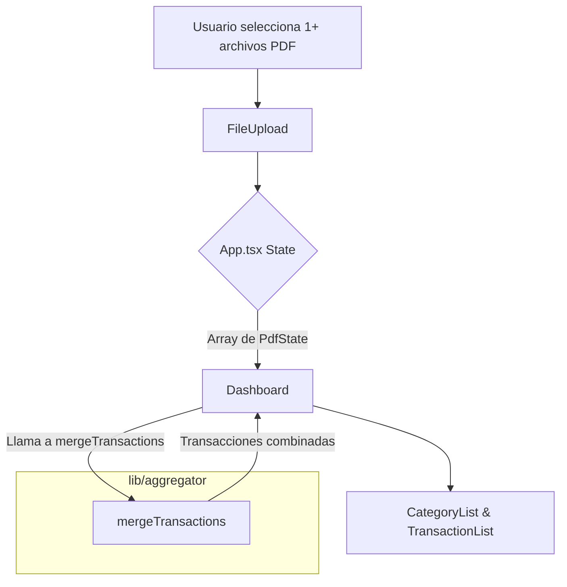
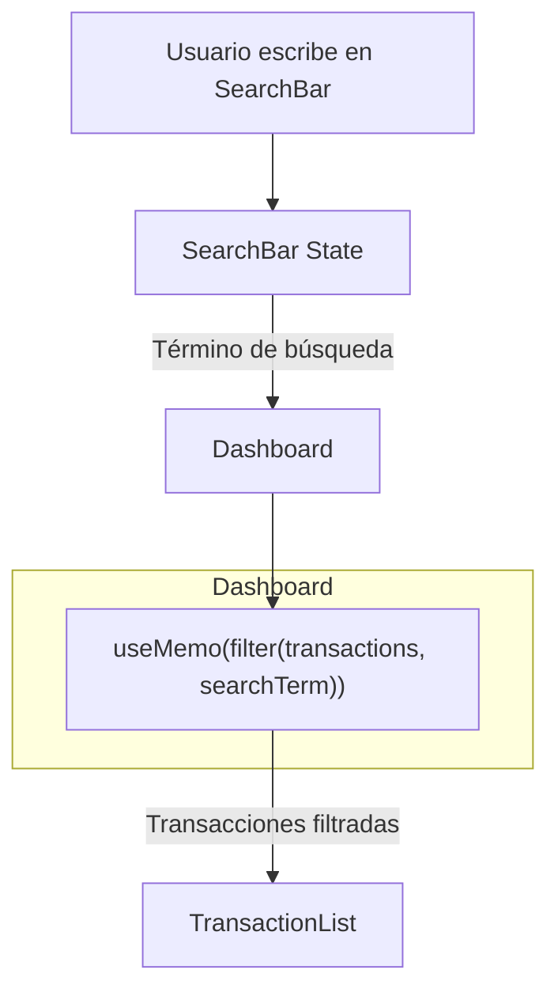
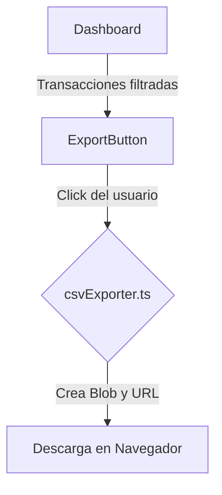

# Diseño Técnico: Exportación y Búsqueda

## 1. Enfoque Técnico

El diseño se centra en implementar las tres funcionalidades (exportación CSV, búsqueda y soporte multi-PDF) directamente en el frontend, aprovechando el estado existente de React y sin introducir dependencias externas. La lógica de negocio se mantiene en el cliente para garantizar simplicidad y rapidez.

- **Exportación CSV**: Se generará un archivo CSV en el cliente utilizando la API `Blob` y `URL.createObjectURL` para ofrecer una descarga directa sin intervención del servidor.
- **Búsqueda**: Se implementará un filtro en tiempo real usando un nuevo componente `SearchBar` y el hook `useMemo` para optimizar el rendimiento, evitando re-cálculos innecesarios.
- **Soporte Multi-PDF**: Se modificará el estado principal en `App.tsx` para gestionar un array de estados de PDF, consolidando las transacciones de todos los archivos cargados en una única vista.

## 2. Decisiones de Arquitectura

### Decisión: Generación de CSV en el Cliente

- **Alternativa Considerada**: Enviar las transacciones a un endpoint del backend para que genere el CSV.
- **Elección**: Generación en el frontend.
- **Justificación**: La cantidad de datos es manejable en el cliente. Este enfoque evita una llamada de red innecesaria, simplifica la arquitectura del backend (que sigue sin estado) y proporciona una respuesta instantánea al usuario. Es más eficiente y económico.

### Decisión: Filtrado de Búsqueda con `useMemo`

- **Alternativa Considerada**: Filtrar las transacciones directamente en el `render` o con un `useEffect`.
- **Elección**: Utilizar `useMemo` para memoizar el resultado del filtrado.
- **Justificación**: Las transacciones y el término de búsqueda son las únicas dependencias. `useMemo` asegura que la lista de transacciones solo se recalcule si cambian los datos o el filtro, optimizando el rendimiento y evitando que la UI se vuelva lenta con listas grandes.

### Decisión: Estado Centralizado para Múltiples PDFs

- **Alternativa Considerada**: Gestionar cada PDF en un estado local del componente `Dashboard`.
- **Elección**: Modificar el estado global en `App.tsx` para almacenar un array de `PdfState`.
- **Justificación**: Centralizar el estado permite que la lógica de agregación y consolidación de transacciones sea más limpia y desacoplada. `App.tsx` se convierte en la única fuente de verdad, y los datos combinados se pasan como props a los componentes hijos, siguiendo un flujo de datos unidireccional claro.

## 3. Desglose de Componentes

- **Nuevos Componentes**:
  - `src/components/atoms/ExportButton.tsx`: Botón que activa la lógica de exportación. Recibirá las transacciones a exportar.
  - `src/components/molecules/SearchBar.tsx`: Componente con un input de texto para que el usuario ingrese su búsqueda. Gestionará su propio estado y lo notificará al `Dashboard`.

- **Componentes a Modificar**:
  - `src/App.tsx`: Actualizar la forma del estado para manejar múltiples PDFs.
  - `src/components/organism/FileUpload.tsx`: Adaptarlo para que pueda recibir y procesar múltiples archivos, actualizando el estado global con cada nuevo PDF.
  - `src/components/organism/Dashboard.tsx`: Integrar el `SearchBar` y el `ExportButton`. Aplicar la lógica de filtrado a las transacciones antes de pasarlas a la lista.

- **Nuevas Funciones Lib**:
  - `src/lib/csvExporter.ts`: Contendrá la lógica para convertir un array de transacciones en un string CSV y disparar la descarga.
  - `src/lib/aggregator.ts`: Se extenderá para recibir un array de arrays de transacciones y fusionarlas en una sola lista.

## 4. Flujo de Datos

### Soporte Multi-PDF



### Búsqueda de Transacciones



### Exportación CSV



## 5. Cambios en el Estado (`App.tsx`)

La estructura de estado actual para un solo PDF será reemplazada por un array.

**Estado Actual (Aproximado):**

```typescript
interface PdfState {
  fileName: string;
  transactions: Transaction[];
  // ...otros campos
}

const [pdfState, setPdfState] = useState<PdfState | null>(null);
```

**Nuevo Estado Propuesto:**

```typescript
interface PdfState {
  id: string; // ID único para cada archivo, ej: timestamp
  fileName: string;
  transactions: Transaction[];
  // ...otros campos
}

const [pdfStates, setPdfStates] = useState<PdfState[]>([]);

// Valor derivado (calculado en App.tsx o Dashboard)
const allTransactions = useMemo(
  () => pdfStates.flatMap((state) => state.transactions),
  [pdfStates]
);
```

## 6. Archivos a Crear o Modificar

| Acción        | Archivo                                        | Responsabilidad                                                                        |
| :------------ | :--------------------------------------------- | :------------------------------------------------------------------------------------- |
| **Crear**     | `openspec/changes/export-y-busqueda/design.md` | Este documento de diseño.                                                              |
| **Crear**     | `src/lib/csvExporter.ts`                       | Contiene la función `exportToCsv` que toma datos y dispara la descarga.                |
| **Crear**     | `src/components/atoms/ExportButton.tsx`        | Componente UI para el botón de exportación.                                            |
| **Crear**     | `src/components/molecules/SearchBar.tsx`       | Componente UI para la barra de búsqueda.                                               |
| **Modificar** | `src/App.tsx`                                  | Actualizar el estado para manejar un array de `PdfState`.                              |
| **Modificar** | `src/components/organism/FileUpload.tsx`       | Permitir la carga de múltiples archivos y actualizar el estado global en consecuencia. |
| **Modificar** | `src/components/organism/Dashboard.tsx`        | Orquestar la búsqueda y la exportación. Usar los datos combinados y filtrados.         |
| **Modificar** | `src/lib/aggregator.ts`                        | Añadir una función para fusionar transacciones de múltiples fuentes.                   |
